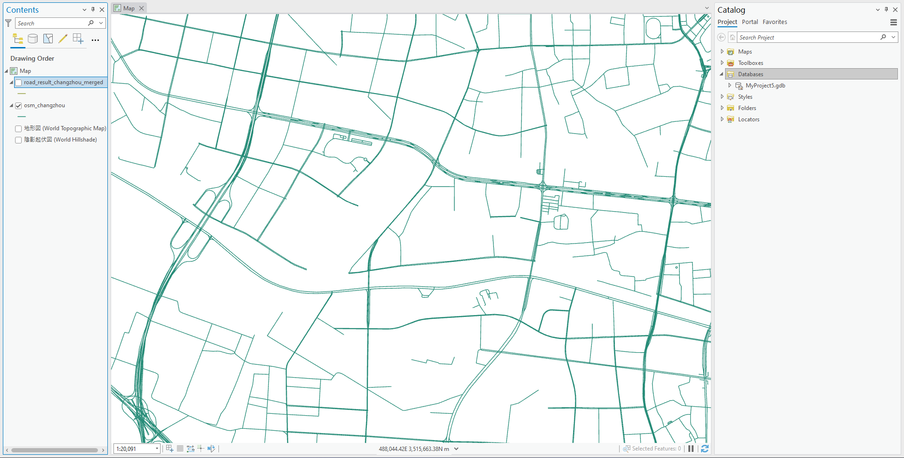
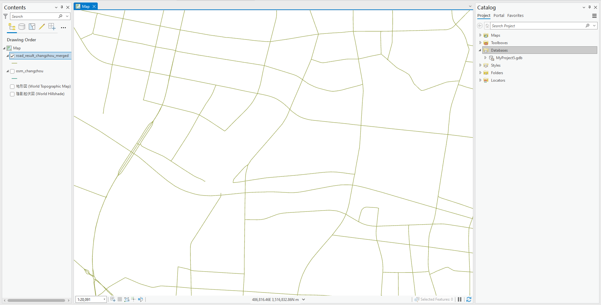

# road_geo_regularization
### 通用的城市主要道路路网简化，可用于非高精度的地块划分等

### Performance:
#### 原始路网
- 
#### 路网简化结果
- 

### 运行环境:
- Arcgis Pro
- Python 3.x from Arcgis Pro 
- Arcpy from Arcgis Pro
- Encoding utf-8_sig

### 所需数据：
- OSM路网数据
- QQ路网数据
- 目标城市行政边界数据
- 数据需要事先按照config.py路径放置，注意命名格式

### 说明书：
1. 先在config/config.py里手动指定目录
    - 配置项：
        - ./config/config.py 需手动指定：
            - GDB文件路径(不存在会自动创建),所有步骤成功执行会自动清空GDB
            - 路网数据根目录(注意路网数据命名规则)
            - boundary数据根目录(注意命名规则)
            - 简化后道路输出文件夹(OUTPUT_PATH)(.shp文件)
        - 道路类别：
            - 目前道路类型选择主要以划分地块为目的，地块内部路网全部抛除，后续定制化精细路网处理时添加新类即可
            - 当MODE为mixed时，不去区分高架桥、普通道路，全部类型同时简化，道路类型在config中配置：
                - OSM_MAIN_FCLASS['motorway', 'trunk', 'primary', 'secondary', 'tertiary']
                - QQ_MAIN_SUBTYPE: ['131184', '131491', '131489']
            - 当MODE为divided时，区分高架桥、普通道路，OSM,QQ的道路需要分一次高架处理与一次普通道路处理，道路类型在config中配置：
                - OSM_MAIN_FCLASS_NO_HIGH：['primary', 'secondary', 'tertiary']
                - OSM_MAIN_FCLASS_HIGH = ['motorway', 'trunk']
                - QQ_MAIN_SUBTYPE_NO_HIGH = ['131184', '131491', '131489']
                - QQ_MAIN_SUBTYPE_HIGH = ['131332']
2. 执行main.py
    - main.py启动函数start_process主要参数：
        - CITY: 城市名，注意命名需要与路网后缀相同(详见注释)
        - MODE：简化方式，必须为'mixed'或'divided'其中一种
        - smooth_level： 简化程度，值越高结果越平滑(失真)
        - extend_distance： 断头路延伸的距离，值越高，闭合的路网越多，(但会在不存在道路的地方伸出一条道路)
        - spike_keep： 清理毛细断头道路的阈值，道路长度低于这个threshold的都会被清除掉，值越高，道路越规整，但会使一些现实是断头路的道路消失

### 整体处理思路：
1.  preprocess：
    - 路网裁剪
    - select by attribute 
2.  多转单:
    - Merge qq & osm
    - Buffer & Dissolve
    - Extract Center lines
3.  路网除杂：
    - 拓扑检查(找出断头道路、验证连通性)
    - 去除断头的琐碎道路
    - centerline根据与raw_road的近似程度，重新sjoin要素属性

### 一个隐藏参数：
在simplify.py的clean_spike函数中有一个keep_spike参数被隐藏起来了，不太常用。

可能会在作图时需要用到断头路数据，若需要可手动将keep_spike改为True.

断头点、断头线数据将会输出到结果路径中，分别命名'err_points.shp'及'err_lines.shp'